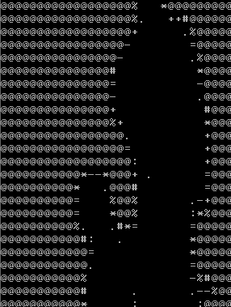

# Bad Apple OS x86 64bit

I've started this project to learn the hard way how difficult to make something that boots in x86_64.

## Build and run

- You can set up the build env via the docker file.
- In docker you can just run `make all` which creates an iso with grub in `dist/x86_64`.

## Screenshot

## License
This project is licensed under the Apache License 2.0 - see the [Apache License 2.0](LICENSE) file for details.
